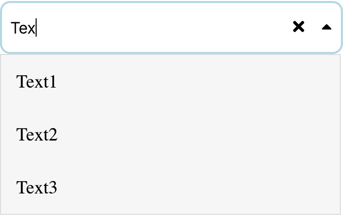
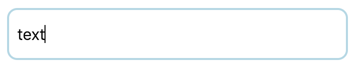
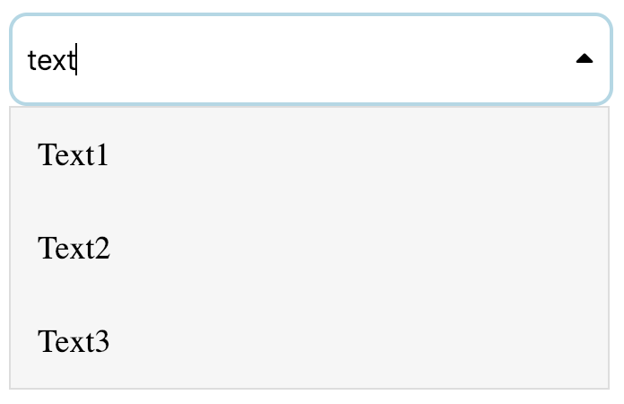
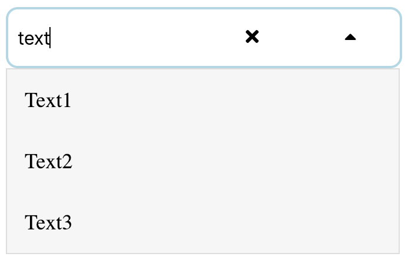

# React Input Picker

 



A simple Input picker for React with listing and selection. Future enhancements will include custom listing so that the user can apply custom styling to options and dropdown.

The Screenshot attached above is the sample when there is dropdown: **Enabled**, remove-control: **Enabled** and having the control-width default to **1**.

The data that you want to show in the dropdown can be passed in **data** prop into the input picker.

```
<InputPickerComponent data={dropdownData} />
```

You can also pass the **filterFunction** which you want to apply when the user types into the input field and show in the dropdown accordingly. The default function that will be happening will be a text search as the user types in.

```
<InputPickerComponent filterFunction={this.onUserInput} />
```

If you wish to disable all the controls and make it a simple input field you can do the following:

Pass the **disableControls** prop as **true** so that it becomes a simple input dropdown.

```
<InputPickerComponent disableControls={true} />
```



If you wish to just disable the remove icon from the input pass the **disableRemove** prop as **true** so the there is no remove icon.

```
<InputPickerComponent disableRemove={true} />
```



If you wish to disable the dropdown on the input field pass the **disableDropdown** prop as **true**.

```
<InputPickerComponent disableDropdown={true} />
```

You can also change the width of the controls showing on the input by passing the prop **controlWidth** with your desired value the default value is **1**

```
<InputPickerComponent controlWidth={3} />
```



# Properties

| Property        | type             | params                                              | Function                                                                                                                        |
| --------------- | ---------------- | --------------------------------------------------- | ------------------------------------------------------------------------------------------------------------------------------- |
| data            | Array of objects | [{ label: "Text1", value: "Text1" }]                | To pass the data into the input picker                                                                                          |
| filterFunction  | Function         | fn(value:String, data:Array, options:Object)        | Filter function that you want to apply on the data. (optional) <br> **Default**: Will do a text search.                         |
| filterOptions   | Object           | {trim: true, strictMatch: false, exactMatch: false} | Filter function options that you can override.                                                                                  |
| disableControls | Boolean          | -                                                   | Disables all the controls and make it the simple input field. (optional)<br>**boolean**: `true/false` <br> **Default**: `false` |
| disableDropdown | Boolean          |                                                     | Disables showing the dropdown. (optional)<br>**boolean**: `true/false` <br> **Default**: `false`                                |
| disableRemove   | Boolean          |                                                     | Disables showing the remove icon. (optional)<br>**boolean**: `true/false` <br> **Default**: `false`                             |
| controlWidth    | Number           | 1 to 12                                             | Sets the width of the control as required (optional)<br>**Number**: `1/2/3` <br> **Default**: `1`                               |
